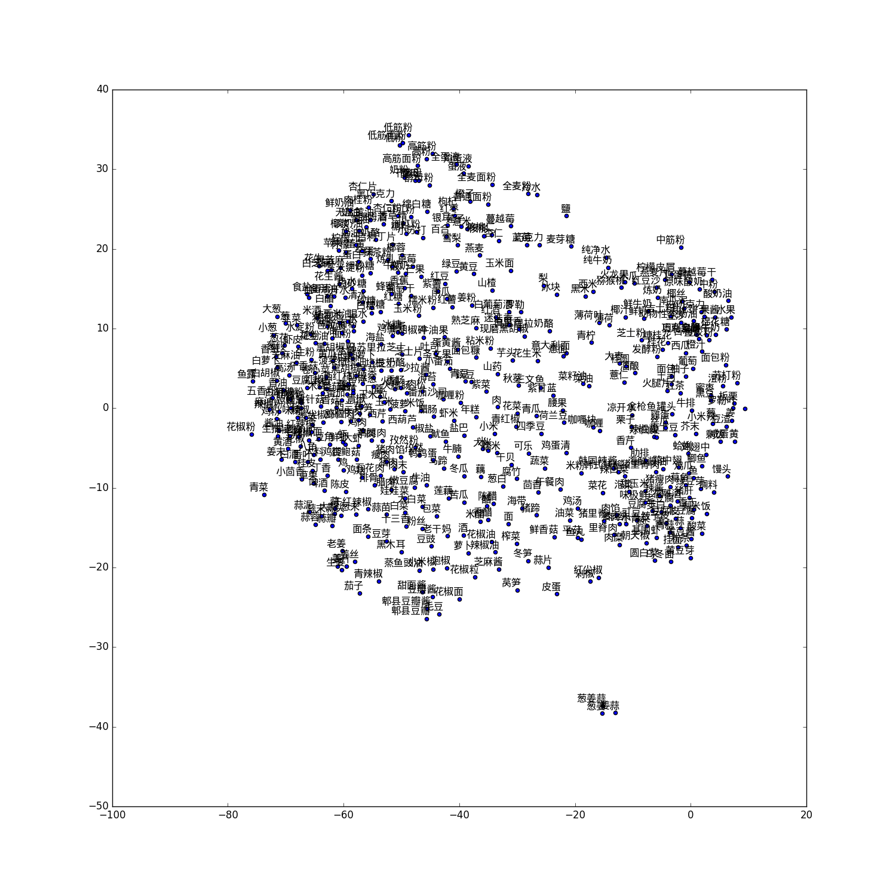
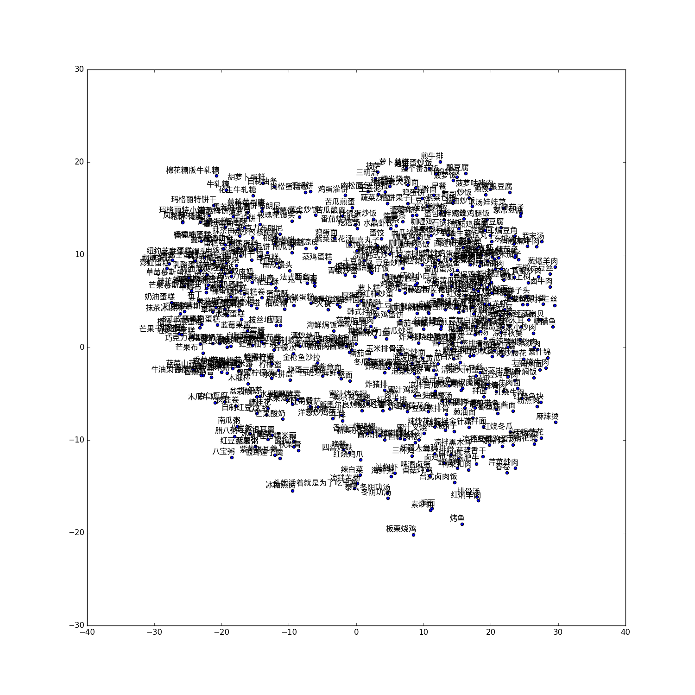

# tofu
An experimental raw food ingredients to recipes recommendation system, used the Embedding and Seq2Seq model.

Used Scrapy to (gently) crawl data from xiachufang.com, a random proxy middleware can be used to avoid ban. 

To run the spider to crawl from the pages

```bash
cd scrapy && scrapy runspider tofu/spiders/recipe.py
```

xiachufang.com also kindly had provided the sitemap of their data, but it's not available now.

After sitemap is ready, use `prepare.py` to prepare dataset `ingredients` and `recipes`, which I have already done for you, check `data/ingredients` and `data/recipes`

Each line of the data indicates a pair relationship between ingredients and recipes.

The script `ingredients.py` turn ingredients and recipes into embedding vectors like these




Then we use `ingredients2recipes.py` which deployed a `Seq2Seq` model to take ingredients as input and recipes as output.
